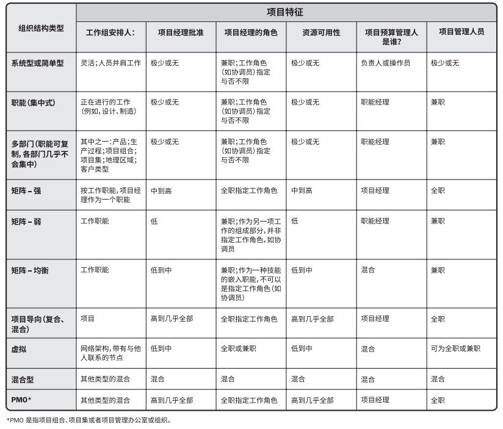

## 组织系统

> **系统** 是各种组件的集合，可以实现单个组件无法实现的成果。
> 
> **组件** 是项目或组织内的可识别要素，提供了某种特定功能或一组相关的功能。

### 1. 概述

##### 1.1 系统因素：

1. 管理要素；
2. 治理框架；
3. 组织结构类型；

##### 1.2 系统的几个原则
1. 系统是动态的；
2. 系统是可以优化的；
3. 系统组件是可以优化的；
4. 系统及其组件不能同时优化；
5. 系统呈现非线性响应(输入的变更并不会产生可预测的输入)；

**问题：**
系统及其系统组件为什么不能同时优化？

### 2. 组织治理框架

##### 2.1 治理框架

**治理框架** 是在组织内行使职权的框架，包括(但不限于)：

1. 规则；
2. 政策；
3. 程序；
4. 规范；
5. 关系；
6. 系统；
7. 过程；

**这个框架会影响：**

1. 组织目标的设定和实现方式；
2. 风险监控和评估方式；
3. 绩效优化方式；

##### 2.2 项目组合、项目集和项目治理

>**项目治理**指用于指导项目管理活动的框架、功能和过程；以达到创造独特的产品、服务或结果以满足组织、战略和运营目标；

 

>**1. 涉及到的四个治理领域**

1. 一致性；
2. 风险；
3. 绩效；
4. 沟通；

>**2. 每个领域都具备以下职能部门**

1. 监督；
2. 控制；
3. 整合；
4. 决策；

### 3. 管理要素

管理要素指组织内部关键职能部门或一般管理原则的组成部分。组织根据其选择的治理框架和组织结构类型分配一般管理要素。

> **3.1 关键职能部门** 或 **一般管理原则** 包括（但不限于）：

1. 基于专业技能和可用性开展工作的部门；
2. 组织授予的工作职权；
3. 工作职责，开展组织根据技能和经验等属性合理分派的工作任务；
4. 具有纪律性的行为（例如尊重职权、人员和规定）；
5. 统一指挥原则（例如一位员工仅接受一个上级对任何行动或活动给出的指示）；
6. 统一领导原则（例如针对一组活动只能有一个计划或一个领导人，以及相同的目标）；
7. 组织的总体目标优先于个人目标；
8. 支付合理的薪酬；
9. **资源的优化使用**；
10. 畅通的沟通渠道；
11. 在正确的时间让正确的人使用正确的材料做正确的事情；
12. 公正、平等地对待所有员工；
13. 明确工作岗位的安全职责；
14. 确保员工安全；
15. 允许任何员工参与计划和实施；
16. 保持员工士气；

### 4. 组织结构类型

>**4.1 如何确定合适的组织结构类型？**

1. 可以采用的组织结构类型；
2. 针对特定组织如何优化组织结构类型的方式；

>**4.2 组织结构选择的考虑因素**

选择组织结构时应考虑的因素包括（但不限于）：

1. 与组织目标的一致性；
2. 专业能力；
3. 控制、效率与效果的程度；
4. 明确的决策升级渠道；
5. 明确的职权线和范围；
6. 授权方面的能力；
7. 终责分配；
8. **职责分配**；
9. 设计的灵活性；
10. 简单的设计；
11. **实施效率**；
12. 成本考虑；
13. 物理位置（例如集中办公、区域办公和虚拟远程办公）；
14. 清晰的沟通（例如政策、工作状态和组织愿景）。

测试

